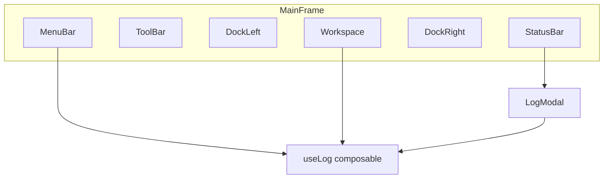

# 组件图（概览）

```mermaid
flowchart TB
  subgraph shell [MainFrame]
    Menu[MenuBar]
    Tool[ToolBar]
    DockL[DockLeft]
    WS[Workspace]
    DockR[DockRight]
    Stat[StatusBar]
  end
  LogWin[LogModal]
  useLog[useLog composable]
  Menu --> useLog
  WS --> useLog
  Stat --> LogWin
  LogWin --> useLog
```
