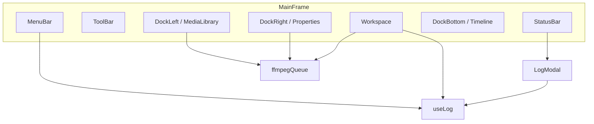

# 组件图（概览）

```mermaid
flowchart TB
  subgraph shell [MainFrame]
    Menu[MenuBar]
    Tool[ToolBar]
    DockL[DockLeft / MediaLibrary]
    WS[Workspace]
    DockR[DockRight / Properties]
    DockB[DockBottom / Timeline]
    Stat[StatusBar]
  end
  LogWin[LogModal]
  useLog[useLog]
  ffmpegQ[ffmpegQueue]
  Menu --> useLog
  WS --> useLog
  DockL --> ffmpegQ
  DockR --> ffmpegQ
  WS --> ffmpegQ
  Stat --> LogWin
  LogWin --> useLog
```

说明：`ffmpegQueue` 抽象表示探针、预览转码、转换任务对 **单一 FFmpeg 实例** 的串行占用；细粒度见 `mapping.md`。
